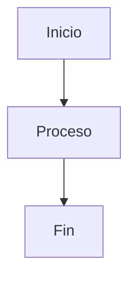

# 📚 Documentación Técnica - BandangWeb API

Documentación completa del proyecto BandangWeb API con diagramas Mermaid.

---

## 📋 Índice de Contenidos

### 🏗️ [Arquitectura](architecture/01-clean-architecture.md)
Descripción detallada de Clean Architecture implementada en el proyecto.

**Contenido**:
- Capas de la arquitectura (Domain, Application, Infrastructure, Presentation)
- Diagramas de dependencias
- Flujo de datos
- Principios SOLID
- Estructura de directorios
- Ejemplo completo end-to-end

**Diagramas incluidos**:
- Diagrama de capas
- Flujo de secuencia (sequence diagram)
- Ejemplo de creación de evento

---

### 🔐 [Flujos de Autenticación](flows/auth-flows.md)
Documentación completa de los flujos de autenticación y autorización.

**Contenido**:
- Registro de usuario
- Login
- Refresh token
- Logout
- Protección de endpoints (RBAC)
- Estructura del JWT
- Consideraciones de seguridad

**Diagramas incluidos**:
- Flujo de registro (sequence diagram)
- Flujo de login (sequence diagram)
- Flujo de refresh token (sequence diagram)
- Flujo de logout (sequence diagram)
- Diagrama RBAC (role-based access control)
- Jerarquía de roles

---

### 🌐 [API Endpoints](api/endpoints.md)
Referencia completa de todos los endpoints de la API.

**Contenido**:
- Autenticación (/auth)
- Usuarios (/users)
- Eventos (/events)
- Multimedia (/multimedia)
- Health check (/health)
- Códigos de estado HTTP
- Ejemplos de requests/responses

**Diagramas incluidos**:
- Diagrama de estructura de endpoints
- Mapa de rutas

---

### 🗄️ [Base de Datos](database/schema.md)
Documentación del esquema de base de datos PostgreSQL/Supabase.

**Contenido**:
- Diagrama ER (Entity-Relationship)
- Descripción de tablas (users, eventos, multimedia)
- Relaciones entre tablas
- Índices
- RLS Policies (Row Level Security)
- Funciones y triggers
- Queries comunes
- Migraciones con Alembic

**Diagramas incluidos**:
- Diagrama ER completo
- Diagrama de relaciones
- Diagrama de seguridad RLS

---

## 🚀 Quick Start

### Ver la Documentación

1. **Arquitectura**: Entiende cómo está organizado el código
   ```bash
   open docs/architecture/01-clean-architecture.md
   ```

2. **Auth Flows**: Aprende cómo funciona la autenticación
   ```bash
   open docs/flows/auth-flows.md
   ```

3. **API Reference**: Consulta los endpoints disponibles
   ```bash
   open docs/api/endpoints.md
   ```

4. **Database**: Revisa el esquema de la base de datos
   ```bash
   open docs/database/schema.md
   ```

### Visualizar Diagramas Mermaid

Los diagramas Mermaid se renderizan automáticamente en:
- GitHub
- GitLab
- VS Code (con extensión Markdown Preview Mermaid)
- [Mermaid Live Editor](https://mermaid.live/)

---

## 📁 Estructura de la Documentación

```
docs/
├── README.md                          # Este archivo
├── architecture/                      # Arquitectura del sistema
│   └── 01-clean-architecture.md      # Clean Architecture explicada
├── flows/                            # Flujos de procesos
│   └── auth-flows.md                # Flujos de autenticación
├── api/                              # Documentación de API
│   └── endpoints.md                  # Referencia de endpoints
├── database/                         # Base de datos
│   └── schema.md                     # Schema y RLS policies
└── diagrams/                         # (Futuros diagramas adicionales)
```

---

## 🎯 Guías por Rol

### Desarrollador Backend
1. Lee [Clean Architecture](architecture/01-clean-architecture.md)
2. Revisa [Auth Flows](flows/auth-flows.md) para entender seguridad
3. Consulta [Database Schema](database/schema.md) para trabajar con datos

### Desarrollador Frontend
1. Revisa [API Endpoints](api/endpoints.md) para integración
2. Lee [Auth Flows](flows/auth-flows.md) para implementar login
3. Consulta códigos de estado HTTP en [Endpoints](api/endpoints.md)

### DevOps
1. Revisa [Database Schema](database/schema.md) para migraciones
2. Consulta [Health Check](api/endpoints.md#health-check) para monitoring
3. Lee consideraciones de seguridad en [Auth Flows](flows/auth-flows.md)

### QA / Testing
1. Revisa [API Endpoints](api/endpoints.md) para casos de prueba
2. Lee [Auth Flows](flows/auth-flows.md) para flows de autenticación
3. Consulta [Database Schema](database/schema.md) para datos de prueba

---

## 🔍 Diagramas Disponibles

### Arquitectura
- ✅ Diagrama de capas (Clean Architecture)
- ✅ Flujo de datos (Sequence Diagram)
- ✅ Ejemplo end-to-end (Graph)

### Autenticación
- ✅ Registro de usuario (Sequence Diagram)
- ✅ Login (Sequence Diagram)
- ✅ Refresh Token (Sequence Diagram)
- ✅ Logout (Sequence Diagram)
- ✅ RBAC (Graph)

### API
- ✅ Estructura de endpoints (Graph)

### Base de Datos
- ✅ Diagrama ER (Entity-Relationship)
- ✅ Relaciones entre tablas (Graph)
- ✅ Seguridad RLS (Flow Diagram)

---

## 📊 Estadísticas de Documentación

| Categoría | Archivos | Diagramas Mermaid | Ejemplos de Código |
|-----------|----------|-------------------|-------------------|
| Arquitectura | 1 | 3 | 10+ |
| Flujos | 1 | 5 | 8+ |
| API | 1 | 2 | 20+ requests |
| Database | 1 | 3 | 10+ queries |
| **Total** | **4** | **13** | **48+** |

---

## 🛠️ Herramientas Recomendadas

### Para Ver Diagramas
- **VS Code**: Instalar [Markdown Preview Mermaid Support](https://marketplace.visualstudio.com/items?itemName=bierner.markdown-mermaid)
- **Online**: [Mermaid Live Editor](https://mermaid.live/)
- **GitHub/GitLab**: Renderizado nativo

### Para Generar Diagramas
- **Mermaid**: [Documentación oficial](https://mermaid.js.org/)
- **PlantUML**: Para diagramas UML adicionales
- **Draw.io**: Para diagramas personalizados

---

## 📚 Referencias Externas

### Arquitectura
- [Clean Architecture - Robert C. Martin](https://blog.cleancoder.com/uncle-bob/2012/08/13/the-clean-architecture.html)
- [SOLID Principles](https://en.wikipedia.org/wiki/SOLID)

### API
- [REST API Best Practices](https://restfulapi.net/)
- [FastAPI Documentation](https://fastapi.tiangolo.com/)
- [Pydantic V2](https://docs.pydantic.dev/latest/)

### Autenticación
- [JWT Best Practices](https://datatracker.ietf.org/doc/html/rfc8725)
- [OWASP Authentication](https://cheatsheetseries.owasp.org/cheatsheets/Authentication_Cheat_Sheet.html)
- [Supabase Auth](https://supabase.com/docs/guides/auth)

### Base de Datos
- [PostgreSQL Documentation](https://www.postgresql.org/docs/)
- [Row Level Security](https://www.postgresql.org/docs/current/ddl-rowsecurity.html)
- [Supabase Database](https://supabase.com/docs/guides/database)

---

## 🤝 Contribuir a la Documentación

### Agregar Nueva Documentación

1. Crea un archivo en la carpeta apropiada:
   ```bash
   touch docs/flows/new-flow.md
   ```

2. Sigue el formato de documentos existentes

3. Incluye diagramas Mermaid cuando sea posible

4. Actualiza este README con el nuevo documento

### Formato de Diagramas Mermaid

```markdown
# Título del Diagrama


```

### Plantilla de Documento

```markdown
# Título del Documento

## 📋 Tabla de Contenidos

- [Sección 1](#sección-1)
- [Sección 2](#sección-2)

---

## Sección 1

Contenido...

### Diagrama


---

## Referencias

- [Link 1](url)
```

---

## 📞 Contacto

Para preguntas sobre la documentación:
- Abrir issue en GitHub
- Contactar al equipo de desarrollo

---

**Última actualización**: Octubre 2025  
**Versión**: 1.0.0

