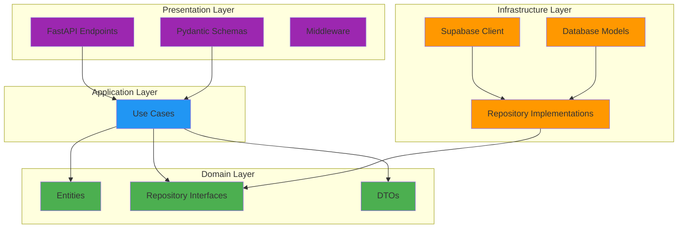
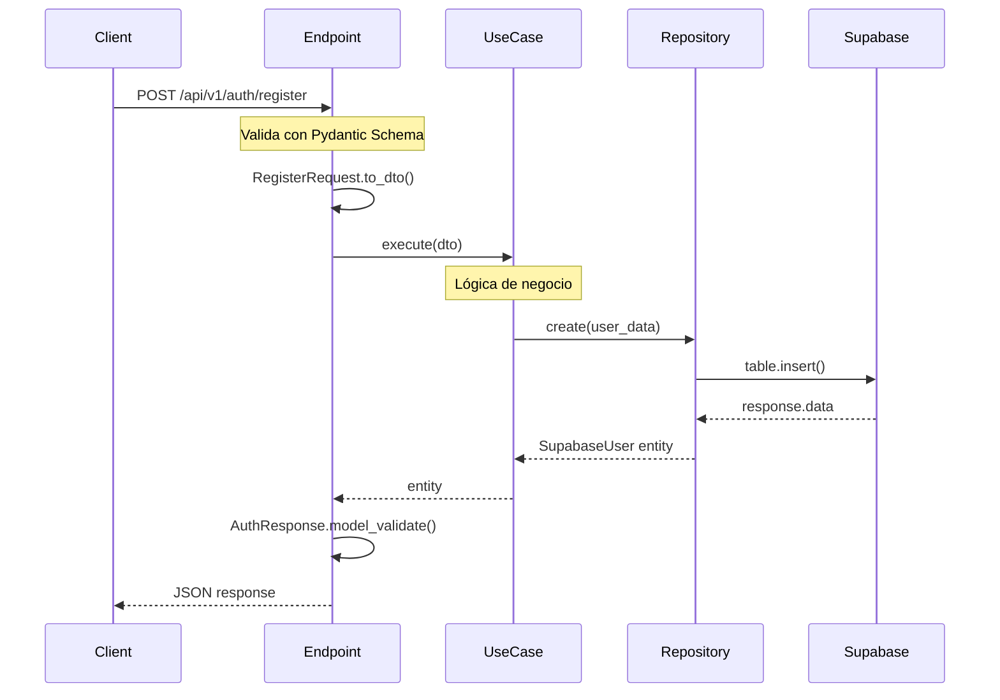

# Clean Architecture - BandangWeb API

## 📋 Tabla de Contenidos

- [Visión General](#visión-general)
- [Capas de la Arquitectura](#capas-de-la-arquitectura)
- [Diagrama de Dependencias](#diagrama-de-dependencias)
- [Flujo de Datos](#flujo-de-datos)
- [Principios SOLID](#principios-solid)

---

## 🎯 Visión General

BandangWeb API implementa **Clean Architecture** (Arquitectura Limpia) propuesta por Robert C. Martin (Uncle Bob). Esta arquitectura separa el código en capas concéntricas con dependencias unidireccionales hacia el centro.

### Beneficios

✅ **Independencia de frameworks**: La lógica de negocio no depende de FastAPI  
✅ **Testeable**: Lógica de negocio fácil de probar sin dependencias externas  
✅ **Independencia de UI**: Puede cambiarse la presentación sin afectar el negocio  
✅ **Independencia de DB**: Puede cambiarse Supabase/PostgreSQL sin afectar el dominio  
✅ **Mantenible**: Código organizado y fácil de modificar  

---

## 🏗️ Capas de la Arquitectura



### 1. Domain Layer (Core) 🟢

**Ubicación**: `app/domain/`

**Responsabilidad**: Contiene la lógica de negocio pura sin dependencias externas.

**Componentes**:

#### Entities (`entities/`)
```python
# app/domain/entities/supabase_user.py
class SupabaseUser(BaseModel):
    """Entidad de dominio: Usuario del sistema"""
    id: UUID
    email: str
    full_name: str
    role: UserRole
    is_active: bool
```

#### Repository Interfaces (`repositories/`)
```python
# app/domain/repositories/supabase_user_repository.py
class SupabaseUserRepository(Protocol):
    """Contrato para operaciones de usuarios"""
    async def get_by_id(self, user_id: UUID) -> SupabaseUser | None: ...
    async def create(self, user_data: dict) -> SupabaseUser: ...
```

#### DTOs (`entities/*_dto.py`)
```python
# app/domain/entities/event_dto.py
@dataclass
class EventCreateDTO:
    """DTO para transferencia de datos sin acoplar capas"""
    name: str
    email: str
    event_type: str
```

---

### 2. Application Layer (Use Cases) 🔵

**Ubicación**: `app/domain/use_cases/`

**Responsabilidad**: Orquesta la lógica de negocio usando entidades y repositorios.

**Estructura**:
```
use_cases/
├── auth/
│   ├── register_user_supabase.py
│   └── login_user_supabase.py
├── events/
│   └── create_event.py
└── multimedia/
    └── create_multimedia.py
```

**Ejemplo**:
```python
# app/domain/use_cases/auth/register_user_supabase.py
class RegisterUserSupabaseUseCase:
    def __init__(self, repository: SupabaseUserRepository):
        self.repository = repository
    
    async def execute(self, email: str, password: str, full_name: str):
        # 1. Validar datos
        # 2. Crear usuario
        # 3. Retornar resultado
        return await self.repository.create(user_data)
```

---

### 3. Infrastructure Layer 🟠

**Ubicación**: `app/infrastructure/`

**Responsabilidad**: Implementa detalles técnicos (DB, APIs externas, cache).

**Componentes**:

#### Repository Implementations (`database/repositories/`)
```python
# app/infrastructure/database/repositories/supabase_user_repository_impl.py
class SupabaseUserRepositoryImpl(SupabaseUserRepository):
    """Implementación concreta usando Supabase"""
    def __init__(self):
        self._supabase_client = supabase_client
    
    async def get_by_id(self, user_id: UUID) -> SupabaseUser | None:
        # Lógica específica de Supabase
        response = await self._supabase_client.client.table("users")...
        return SupabaseUser.model_validate(response.data[0])
```

#### External Services (`external/`)
```python
# app/infrastructure/external/supabase/client.py
class SupabaseClient:
    """Cliente singleton de Supabase"""
    @property
    async def client(self):
        return self._client
    
    @property
    async def admin_client(self):
        return self._admin_client
```

---

### 4. Presentation Layer 🟣

**Ubicación**: `app/presentation/`

**Responsabilidad**: Expone la API REST y maneja HTTP.

**Componentes**:

#### Endpoints (`api/v1/endpoints/`)
```python
# app/presentation/api/v1/endpoints/supabase_auth.py
@router.post("/register", response_model=AuthResponse)
async def register(
    user_data: RegisterRequest,
    use_case: RegisterUserSupabaseUseCase = Depends(get_register_use_case)
):
    result = await use_case.execute(...)
    return AuthResponse.model_validate(result)
```

#### Schemas (`api/v1/schemas/`)
```python
# app/presentation/api/v1/schemas/supabase_auth.py
class RegisterRequest(BaseModel):
    """Schema de entrada para registro"""
    email: EmailStr
    password: str
    full_name: str
    
    def to_dto(self) -> UserCreateDTO:
        """Convierte schema a DTO de dominio"""
        return UserCreateDTO(...)
```

#### Middleware (`middleware/`)
- `logging.py`: Logging estructurado
- `security_headers.py`: Headers de seguridad
- `rate_limit.py`: Rate limiting

---

## 🔄 Flujo de Datos



### Explicación del Flujo:

1. **Cliente → Endpoint**: Hace request HTTP con JSON
2. **Endpoint**: Valida datos con Pydantic Schema
3. **Schema → DTO**: Convierte usando `to_dto()`
4. **Endpoint → Use Case**: Llama `execute()` con DTO
5. **Use Case**: Aplica lógica de negocio
6. **Use Case → Repository**: Usa interfaz del repositorio
7. **Repository → Supabase**: Implementación específica
8. **Supabase → Repository**: Devuelve datos raw
9. **Repository → Use Case**: Devuelve Entity de dominio
10. **Use Case → Endpoint**: Devuelve Entity
11. **Endpoint**: Convierte Entity → Schema de respuesta
12. **Endpoint → Cliente**: Retorna JSON

---

## 📐 Principios SOLID

### Single Responsibility Principle (SRP)
Cada clase tiene una sola responsabilidad:
- **Entities**: Representan conceptos de negocio
- **Repositories**: Acceso a datos
- **Use Cases**: Un caso de uso específico
- **Schemas**: Validación de entrada/salida

### Open/Closed Principle (OCP)
Abierto para extensión, cerrado para modificación:
```python
# Puedes agregar nuevas implementaciones de repositorio
# sin modificar el Use Case
class PostgresUserRepository(SupabaseUserRepository):
    # Nueva implementación
    pass
```

### Liskov Substitution Principle (LSP)
Las implementaciones son intercambiables:
```python
# Cualquier implementación de SupabaseUserRepository funciona
use_case = RegisterUserSupabaseUseCase(SupabaseUserRepositoryImpl())
# o
use_case = RegisterUserSupabaseUseCase(MockUserRepository())  # Para tests
```

### Interface Segregation Principle (ISP)
Interfaces específicas en lugar de genéricas:
```python
# En lugar de un mega-repositorio, tenemos interfaces específicas
class EventRepository(Protocol):
    async def create(self, event_data: EventCreateDTO) -> Event: ...

class MultimediaRepository(Protocol):
    async def create(self, media_data: dict) -> Multimedia: ...
```

### Dependency Inversion Principle (DIP)
Depender de abstracciones, no de implementaciones:
```python
# Use Case depende de Protocol (abstracción)
class LoginUserSupabaseUseCase:
    def __init__(self, repository: SupabaseUserRepository):  # Protocol
        self.repository = repository  # No depende de implementación concreta
```

---

## 📂 Estructura de Directorios

```
app/
├── domain/                    # 🟢 DOMAIN LAYER
│   ├── entities/             # Entidades de negocio
│   │   ├── supabase_user.py
│   │   ├── event.py
│   │   ├── event_dto.py      # DTOs
│   │   └── multimedia.py
│   ├── repositories/         # Interfaces (Protocols)
│   │   ├── supabase_user_repository.py
│   │   ├── event_repository.py
│   │   └── multimedia_repository.py
│   └── use_cases/            # 🔵 APPLICATION LAYER
│       ├── auth/
│       │   ├── register_user_supabase.py
│       │   └── login_user_supabase.py
│       ├── events/
│       │   └── create_event.py
│       └── multimedia/
│           └── create_multimedia.py
│
├── infrastructure/           # 🟠 INFRASTRUCTURE LAYER
│   ├── database/
│   │   ├── repositories/     # Implementaciones concretas
│   │   │   ├── supabase_user_repository_impl.py
│   │   │   ├── event_repository_impl.py
│   │   │   └── multimedia_repository_impl.py
│   │   └── models/           # Modelos SQLAlchemy (si se usan)
│   │       └── base.py
│   └── external/
│       └── supabase/
│           └── client.py     # Cliente de Supabase
│
├── presentation/             # 🟣 PRESENTATION LAYER
│   ├── api/
│   │   └── v1/
│   │       ├── endpoints/
│   │       │   ├── supabase_auth.py
│   │       │   ├── users.py
│   │       │   ├── events.py
│   │       │   └── multimedia.py
│   │       └── schemas/
│   │           ├── supabase_auth.py
│   │           ├── event.py
│   │           └── multimedia.py
│   └── middleware/
│       ├── logging.py
│       ├── security_headers.py
│       └── rate_limit.py
│
└── core/                     # Utilidades compartidas
    ├── config.py
    ├── security.py
    ├── dependencies.py
    └── exceptions.py
```

---

## 🎯 Reglas de Dependencia

### ✅ Permitido
```
Presentation → Application → Domain
Infrastructure → Domain (implementa interfaces)
```

### ❌ Prohibido
```
Domain → Infrastructure  ❌
Domain → Presentation    ❌
Application → Infrastructure ❌ (solo via interfaces)
```

---

## 🔍 Ejemplo Completo: Crear Evento

```mermaid
graph LR
    A[POST /api/v1/events] --> B[EventCreate Schema]
    B --> C[to_dto]
    C --> D[EventCreateDTO]
    D --> E[CreateEventUseCase]
    E --> F[EventRepository Interface]
    F --> G[EventRepositoryImpl]
    G --> H[Supabase Client]
    H --> I[PostgreSQL]
    
    style D fill:#4CAF50
    style E fill:#2196F3
    style F fill:#4CAF50
    style G fill:#FF9800
    style B fill:#9C27B0
```



### Código:

```python
# 1. PRESENTATION: Schema
class EventCreate(BaseModel):
    name: str
    email: EmailStr
    event_type: str
    
    def to_dto(self) -> EventCreateDTO:
        return EventCreateDTO(name=self.name, ...)

# 2. DOMAIN: DTO
@dataclass
class EventCreateDTO:
    name: str
    email: str
    event_type: str

# 3. DOMAIN: Repository Interface
class EventRepository(Protocol):
    async def create(self, event_data: EventCreateDTO) -> Event: ...

# 4. APPLICATION: Use Case
class CreateEventUseCase:
    def __init__(self, repository: EventRepository):
        self.repository = repository
    
    async def execute(self, event_data: EventCreateDTO) -> Event:
        return await self.repository.create(event_data)

# 5. INFRASTRUCTURE: Implementation
class EventRepositoryImpl(EventRepository):
    async def create(self, event_data: EventCreateDTO) -> Event:
        event_dict = asdict(event_data)
        response = await supabase_client.table("eventos").insert(event_dict)
        return Event.model_validate(response.data[0])

# 6. PRESENTATION: Endpoint
@router.post("/events", response_model=EventRead)
async def create_event(
    event_data: EventCreate,
    use_case: CreateEventUseCase = Depends(get_create_event_use_case)
):
    event_dto = event_data.to_dto()
    created_event = await use_case.execute(event_dto)
    return EventRead.model_validate(created_event)
```

---

## 📚 Referencias

- [Clean Architecture - Robert C. Martin](https://blog.cleancoder.com/uncle-bob/2012/08/13/the-clean-architecture.html)
- [SOLID Principles](https://en.wikipedia.org/wiki/SOLID)
- [Dependency Inversion Principle](https://en.wikipedia.org/wiki/Dependency_inversion_principle)

