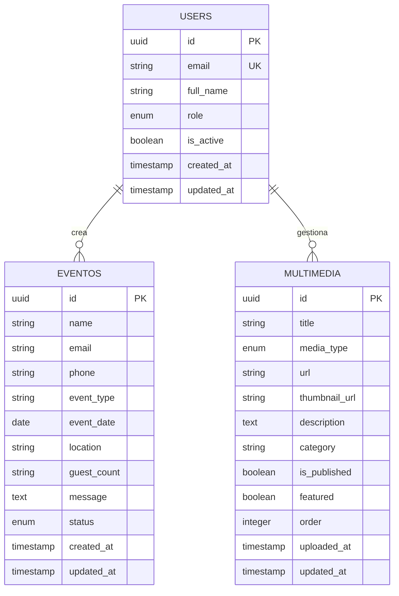
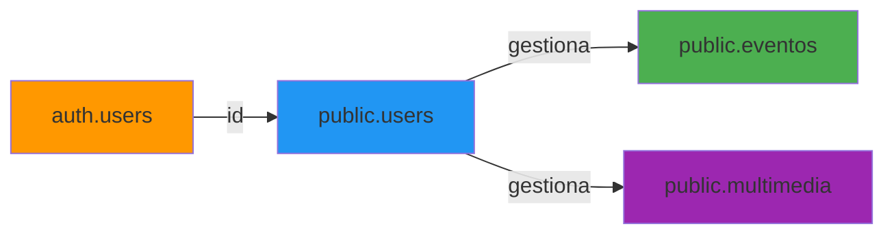
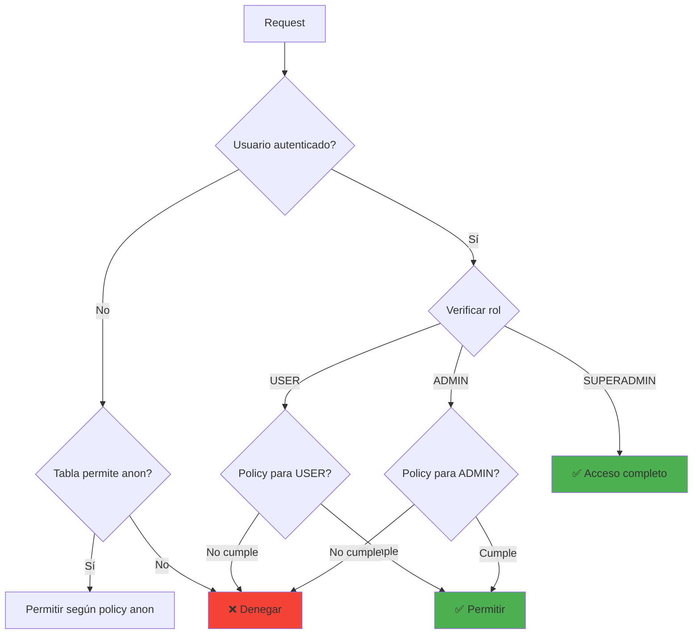

# Database Schema - BandangWeb API

## 📋 Tabla de Contenidos

- [Visión General](#visión-general)
- [Diagrama ER](#diagrama-er)
- [Tablas](#tablas)
- [Relaciones](#relaciones)
- [Índices](#índices)
- [RLS Policies](#rls-policies)

---

## 🎯 Visión General

BandangWeb API utiliza **PostgreSQL** como base de datos a través de **Supabase**.

### Características

✅ Row Level Security (RLS)  
✅ Triggers automáticos  
✅ Índices optimizados  
✅ UUID como primary keys  
✅ Timestamps automáticos  

---

## 📊 Diagrama ER (Entity-Relationship)



---

## 🗂️ Tablas

### `users` (public.users)

Almacena información de usuarios de la aplicación.

| Campo | Tipo | Constraints | Descripción |
|-------|------|-------------|-------------|
| `id` | UUID | PK, NOT NULL | ID del usuario (referencia a auth.users) |
| `email` | VARCHAR(255) | UNIQUE, NOT NULL | Email del usuario |
| `full_name` | VARCHAR(255) | NOT NULL | Nombre completo |
| `role` | VARCHAR(20) | NOT NULL, DEFAULT 'USER' | Rol: USER, ADMIN, SUPERADMIN |
| `is_active` | BOOLEAN | NOT NULL, DEFAULT true | Usuario activo |
| `created_at` | TIMESTAMPTZ | NOT NULL, DEFAULT now() | Fecha de creación |
| `updated_at` | TIMESTAMPTZ | NOT NULL, DEFAULT now() | Fecha de actualización |

**Índices**:
- `users_pkey` ON (id)
- `users_email_key` ON (email)
- `idx_users_role` ON (role)
- `idx_users_active` ON (is_active)

**Trigger**:
```sql
CREATE TRIGGER update_users_updated_at
BEFORE UPDATE ON public.users
FOR EACH ROW
EXECUTE FUNCTION update_updated_at_column();
```

---

### `eventos` (public.eventos)

Almacena solicitudes de eventos de clientes.

| Campo | Tipo | Constraints | Descripción |
|-------|------|-------------|-------------|
| `id` | UUID | PK, NOT NULL, DEFAULT uuid_generate_v4() | ID del evento |
| `name` | VARCHAR(255) | NOT NULL | Nombre del cliente |
| `email` | VARCHAR(255) | NOT NULL | Email de contacto |
| `phone` | VARCHAR(20) | NOT NULL | Teléfono de contacto |
| `event_type` | VARCHAR(100) | NOT NULL | Tipo: Boda, XV Años, etc. |
| `event_date` | DATE | NOT NULL | Fecha del evento |
| `location` | TEXT | NOT NULL | Ubicación del evento |
| `guest_count` | VARCHAR(50) | NOT NULL | Rango de invitados |
| `message` | TEXT | NULL | Mensaje adicional |
| `status` | VARCHAR(20) | NOT NULL, DEFAULT 'pending' | Estado: pending, confirmed, cancelled |
| `created_at` | TIMESTAMPTZ | NOT NULL, DEFAULT now() | Fecha de creación |
| `updated_at` | TIMESTAMPTZ | NOT NULL, DEFAULT now() | Fecha de actualización |

**Índices**:
- `eventos_pkey` ON (id)
- `idx_eventos_status` ON (status)
- `idx_eventos_event_date` ON (event_date)
- `idx_eventos_created_at` ON (created_at DESC)

**Trigger**:
```sql
CREATE TRIGGER update_eventos_updated_at
BEFORE UPDATE ON public.eventos
FOR EACH ROW
EXECUTE FUNCTION update_updated_at_column();
```

---

### `multimedia` (public.multimedia)

Almacena contenido multimedia (imágenes, videos).

| Campo | Tipo | Constraints | Descripción |
|-------|------|-------------|-------------|
| `id` | UUID | PK, NOT NULL, DEFAULT uuid_generate_v4() | ID del contenido |
| `title` | VARCHAR(255) | NOT NULL | Título del contenido |
| `media_type` | VARCHAR(20) | NOT NULL | Tipo: image, video |
| `url` | TEXT | NOT NULL | URL del contenido |
| `thumbnail_url` | TEXT | NULL | URL del thumbnail |
| `description` | TEXT | NULL | Descripción |
| `category` | VARCHAR(100) | NULL | Categoría |
| `is_published` | BOOLEAN | NOT NULL, DEFAULT false | Publicado |
| `featured` | BOOLEAN | NOT NULL, DEFAULT false | Destacado |
| `order` | INTEGER | NOT NULL, DEFAULT 0 | Orden de visualización |
| `uploaded_at` | TIMESTAMPTZ | NOT NULL, DEFAULT now() | Fecha de subida |
| `updated_at` | TIMESTAMPTZ | NOT NULL, DEFAULT now() | Fecha de actualización |

**Índices**:
- `multimedia_pkey` ON (id)
- `idx_multimedia_type` ON (media_type)
- `idx_multimedia_published` ON (is_published)
- `idx_multimedia_featured` ON (featured)
- `idx_multimedia_order` ON (order)

**Trigger**:
```sql
CREATE TRIGGER update_multimedia_updated_at
BEFORE UPDATE ON public.multimedia
FOR EACH ROW
EXECUTE FUNCTION update_updated_at_column();
```

---

## 🔗 Relaciones



### `auth.users` → `public.users`
- **Tipo**: 1:1
- **FK**: `public.users.id` → `auth.users.id`
- **Cascade**: ON DELETE CASCADE

**Trigger de sincronización**:
```sql
CREATE TRIGGER on_auth_user_created
AFTER INSERT ON auth.users
FOR EACH ROW
EXECUTE FUNCTION sync_user_to_public();
```

---

## 🔍 Índices

### Índices Principales

```sql
-- Users
CREATE INDEX idx_users_email ON public.users(email);
CREATE INDEX idx_users_role ON public.users(role);
CREATE INDEX idx_users_active ON public.users(is_active);

-- Eventos
CREATE INDEX idx_eventos_status ON public.eventos(status);
CREATE INDEX idx_eventos_event_date ON public.eventos(event_date);
CREATE INDEX idx_eventos_created_at ON public.eventos(created_at DESC);

-- Multimedia
CREATE INDEX idx_multimedia_type ON public.multimedia(media_type);
CREATE INDEX idx_multimedia_published ON public.multimedia(is_published);
CREATE INDEX idx_multimedia_category ON public.multimedia(category);
CREATE INDEX idx_multimedia_order ON public.multimedia(order);
```

### Índices Compuestos

```sql
-- Multimedia: Filtrado común (publicados + tipo)
CREATE INDEX idx_multimedia_published_type 
ON public.multimedia(is_published, media_type);

-- Multimedia: Orden de visualización
CREATE INDEX idx_multimedia_published_order 
ON public.multimedia(is_published, order) 
WHERE is_published = true;
```

---

## 🔒 RLS Policies (Row Level Security)

### `users` Table

```sql
-- Habilitar RLS
ALTER TABLE public.users ENABLE ROW LEVEL SECURITY;

-- Policy: Usuarios pueden ver su propio perfil
CREATE POLICY "Users can view own profile"
ON public.users
FOR SELECT
TO authenticated
USING (auth.uid() = id);

-- Policy: Admins pueden ver todos los usuarios
CREATE POLICY "Admins can view all users"
ON public.users
FOR SELECT
TO authenticated
USING (
  EXISTS (
    SELECT 1 FROM public.users
    WHERE id = auth.uid() 
    AND role IN ('ADMIN', 'SUPERADMIN')
  )
);

-- Policy: Admins pueden actualizar usuarios
CREATE POLICY "Admins can update users"
ON public.users
FOR UPDATE
TO authenticated
USING (
  EXISTS (
    SELECT 1 FROM public.users
    WHERE id = auth.uid() 
    AND role IN ('ADMIN', 'SUPERADMIN')
  )
);
```

### `eventos` Table

```sql
-- Habilitar RLS
ALTER TABLE public.eventos ENABLE ROW LEVEL SECURITY;

-- Policy: Cualquiera puede insertar eventos (formulario público)
CREATE POLICY "Anyone can insert events"
ON public.eventos
FOR INSERT
TO anon, authenticated
WITH CHECK (true);

-- Policy: Admins pueden ver todos los eventos
CREATE POLICY "Admins can view events"
ON public.eventos
FOR SELECT
TO authenticated
USING (
  EXISTS (
    SELECT 1 FROM public.users
    WHERE id = auth.uid() 
    AND role IN ('ADMIN', 'SUPERADMIN')
  )
);

-- Policy: Admins pueden actualizar eventos
CREATE POLICY "Admins can update events"
ON public.eventos
FOR UPDATE
TO authenticated
USING (
  EXISTS (
    SELECT 1 FROM public.users
    WHERE id = auth.uid() 
    AND role IN ('ADMIN', 'SUPERADMIN')
  )
);
```

### `multimedia` Table

```sql
-- Habilitar RLS
ALTER TABLE public.multimedia ENABLE ROW LEVEL SECURITY;

-- Policy: Cualquiera puede ver contenido publicado
CREATE POLICY "Anyone can view published multimedia"
ON public.multimedia
FOR SELECT
TO anon, authenticated
USING (is_published = true);

-- Policy: Admins pueden ver todo el contenido
CREATE POLICY "Admins can view all multimedia"
ON public.multimedia
FOR SELECT
TO authenticated
USING (
  EXISTS (
    SELECT 1 FROM public.users
    WHERE id = auth.uid() 
    AND role IN ('ADMIN', 'SUPERADMIN')
  )
);

-- Policy: Admins pueden insertar multimedia
CREATE POLICY "Admins can insert multimedia"
ON public.multimedia
FOR INSERT
TO authenticated
WITH CHECK (
  EXISTS (
    SELECT 1 FROM public.users
    WHERE id = auth.uid() 
    AND role IN ('ADMIN', 'SUPERADMIN')
  )
);

-- Policy: Admins pueden actualizar multimedia
CREATE POLICY "Admins can update multimedia"
ON public.multimedia
FOR UPDATE
TO authenticated
USING (
  EXISTS (
    SELECT 1 FROM public.users
    WHERE id = auth.uid() 
    AND role IN ('ADMIN', 'SUPERADMIN')
  )
);

-- Policy: Admins pueden eliminar multimedia
CREATE POLICY "Admins can delete multimedia"
ON public.multimedia
FOR DELETE
TO authenticated
USING (
  EXISTS (
    SELECT 1 FROM public.users
    WHERE id = auth.uid() 
    AND role IN ('ADMIN', 'SUPERADMIN')
  )
);
```

---

## 🛠️ Funciones de Base de Datos

### `update_updated_at_column()`

Actualiza automáticamente el campo `updated_at`.

```sql
CREATE OR REPLACE FUNCTION update_updated_at_column()
RETURNS TRIGGER AS $$
BEGIN
    NEW.updated_at = now();
    RETURN NEW;
END;
$$ LANGUAGE plpgsql;
```

### `sync_user_to_public()`

Sincroniza usuarios de `auth.users` a `public.users`.

```sql
CREATE OR REPLACE FUNCTION sync_user_to_public()
RETURNS TRIGGER AS $$
BEGIN
    INSERT INTO public.users (id, email, full_name, role)
    VALUES (
        NEW.id,
        NEW.email,
        COALESCE(NEW.raw_user_meta_data->>'full_name', ''),
        'USER'
    );
    RETURN NEW;
END;
$$ LANGUAGE plpgsql SECURITY DEFINER;
```

---

## 📚 Queries Comunes

### Listar usuarios activos por rol
```sql
SELECT id, email, full_name, role, created_at
FROM public.users
WHERE is_active = true
ORDER BY role DESC, created_at DESC;
```

### Eventos pendientes ordenados por fecha
```sql
SELECT id, name, email, event_type, event_date, status
FROM public.eventos
WHERE status = 'pending'
ORDER BY event_date ASC;
```

### Multimedia publicado y destacado
```sql
SELECT id, title, media_type, url, category
FROM public.multimedia
WHERE is_published = true AND featured = true
ORDER BY "order" ASC, uploaded_at DESC;
```

### Estadísticas de eventos por tipo
```sql
SELECT 
    event_type,
    COUNT(*) as total,
    COUNT(*) FILTER (WHERE status = 'pending') as pending,
    COUNT(*) FILTER (WHERE status = 'confirmed') as confirmed
FROM public.eventos
GROUP BY event_type
ORDER BY total DESC;
```

---

## 📊 Diagrama de Seguridad RLS



---

## 🔧 Migraciones con Alembic

Las migraciones están en: `alembic/versions/`

```bash
# Crear nueva migración
poetry run alembic revision --autogenerate -m "Descripción"

# Aplicar migraciones
poetry run alembic upgrade head

# Rollback
poetry run alembic downgrade -1
```

---

## 📚 Referencias

- [Supabase Database Documentation](https://supabase.com/docs/guides/database)
- [PostgreSQL Documentation](https://www.postgresql.org/docs/)
- [Row Level Security (RLS)](https://www.postgresql.org/docs/current/ddl-rowsecurity.html)

