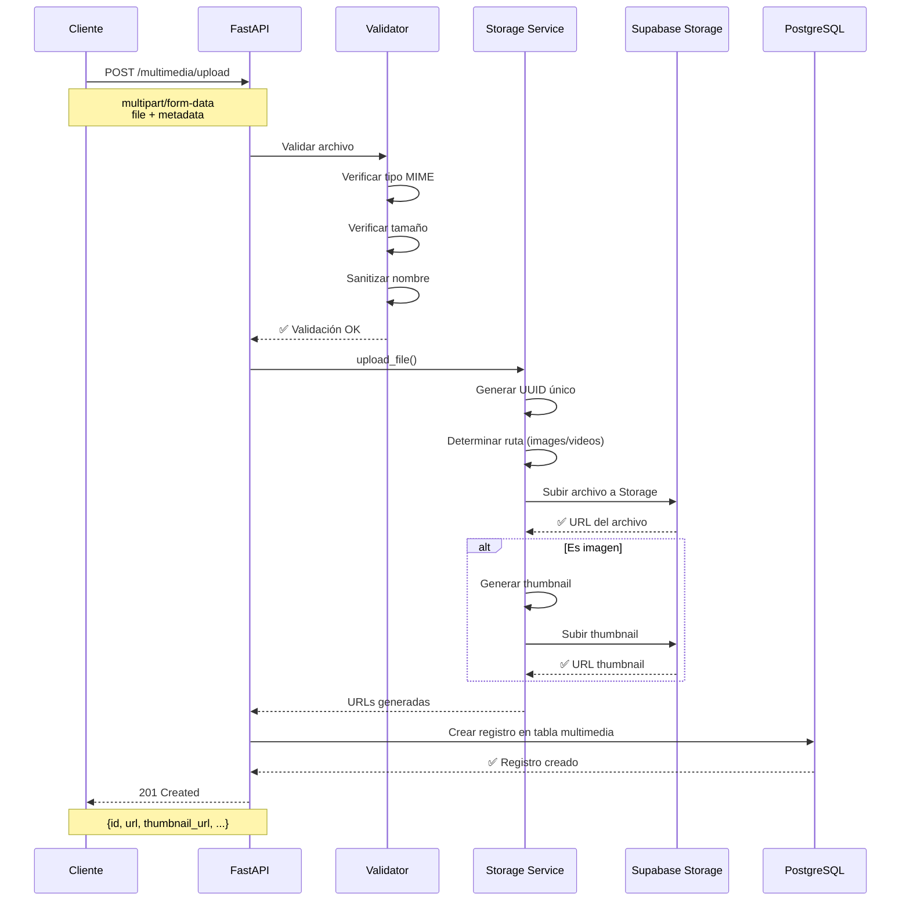

# Arquitectura de Supabase Storage - BandangWeb API

## 📋 Tabla de Contenidos

- [Visión General](#visión-general)
- [Estructura de Buckets](#estructura-de-buckets)
- [Storage Policies](#storage-policies)
- [Flujo de Upload](#flujo-de-upload)
- [Validaciones](#validaciones)
- [Optimizaciones](#optimizaciones)

---

## 🎯 Visión General

BandangWeb API utiliza **Supabase Storage** para almacenar y servir contenido multimedia (imágenes y videos) de manera eficiente y segura.

### Características

✅ Upload directo a Supabase Storage
✅ Validación de tipo MIME y tamaño
✅ Generación automática de thumbnails para imágenes
✅ URLs públicas firmadas con expiración
✅ Organización por tipo de contenido
✅ Políticas de acceso granulares

---

## 🗂️ Estructura de Buckets

### Bucket Principal: `bandang-multimedia`

```
bandang-multimedia/
├── images/
│   ├── {uuid}.jpg
│   ├── {uuid}.png
│   └── {uuid}.webp
├── videos/
│   ├── {uuid}.mp4
│   └── {uuid}.mov
└── thumbnails/
    └── {uuid}_thumb.jpg
```

**Configuración del Bucket:**
- **Nombre**: `bandang-multimedia`
- **Public**: `false` (acceso controlado por policies)
- **File size limit**: 50 MB para imágenes, 200 MB para videos
- **Allowed MIME types**:
  - Imágenes: `image/jpeg`, `image/png`, `image/webp`, `image/gif`
  - Videos: `video/mp4`, `video/quicktime`, `video/webm`

---

## 🔒 Storage Policies

### 1. Policy: Usuarios autenticados pueden subir archivos

```sql
CREATE POLICY "Authenticated users can upload multimedia"
ON storage.objects
FOR INSERT
TO authenticated
WITH CHECK (
  bucket_id = 'bandang-multimedia'
  AND (auth.role() = 'authenticated')
  AND (
    -- Solo admins pueden subir
    EXISTS (
      SELECT 1 FROM public.profiles
      WHERE id = auth.uid()
      AND role IN ('ADMIN', 'SUPERADMIN')
    )
  )
);
```

### 2. Policy: Usuarios autenticados pueden leer archivos

```sql
CREATE POLICY "Authenticated users can read multimedia"
ON storage.objects
FOR SELECT
TO authenticated
USING (
  bucket_id = 'bandang-multimedia'
);
```

### 3. Policy: Solo admins pueden actualizar archivos

```sql
CREATE POLICY "Admins can update multimedia"
ON storage.objects
FOR UPDATE
TO authenticated
USING (
  bucket_id = 'bandang-multimedia'
  AND EXISTS (
    SELECT 1 FROM public.profiles
    WHERE id = auth.uid()
    AND role IN ('ADMIN', 'SUPERADMIN')
  )
);
```

### 4. Policy: Solo admins pueden eliminar archivos

```sql
CREATE POLICY "Admins can delete multimedia"
ON storage.objects
FOR DELETE
TO authenticated
USING (
  bucket_id = 'bandang-multimedia'
  AND EXISTS (
    SELECT 1 FROM public.profiles
    WHERE id = auth.uid()
    AND role IN ('ADMIN', 'SUPERADMIN')
  )
);
```

---

## 📤 Flujo de Upload

### Diagrama de Secuencia



---

## ✅ Validaciones

### 1. Validación de Tipo MIME

```python
ALLOWED_IMAGE_TYPES = {
    "image/jpeg": ".jpg",
    "image/png": ".png",
    "image/webp": ".webp",
    "image/gif": ".gif",
}

ALLOWED_VIDEO_TYPES = {
    "video/mp4": ".mp4",
    "video/quicktime": ".mov",
    "video/webm": ".webm",
}
```

### 2. Validación de Tamaño

```python
MAX_IMAGE_SIZE = 50 * 1024 * 1024  # 50 MB
MAX_VIDEO_SIZE = 200 * 1024 * 1024  # 200 MB
```

### 3. Validación de Contenido

- Verificar magic bytes del archivo (no solo extensión)
- Prevenir archivos ejecutables disfrazados
- Sanitizar nombres de archivo

### 4. Validación de Metadata

```python
class MultimediaUploadRequest(BaseModel):
    title: str = Field(..., min_length=1, max_length=255)
    description: str | None = Field(None, max_length=1000)
    category: str | None = Field(None, max_length=100)
    is_published: bool = Field(default=False)
    featured: bool = Field(default=False)
    order: int = Field(default=0, ge=0)
```

---

## 🚀 Optimizaciones

### 1. Generación de Thumbnails

Para imágenes, se genera automáticamente un thumbnail de 400x300px:

```python
from PIL import Image
import io

def generate_thumbnail(image_bytes: bytes, size=(400, 300)) -> bytes:
    img = Image.open(io.BytesIO(image_bytes))
    img.thumbnail(size, Image.Resampling.LANCZOS)

    output = io.BytesIO()
    img.save(output, format='JPEG', quality=85, optimize=True)
    output.seek(0)

    return output.getvalue()
```

### 2. URLs Públicas con Expiración

```python
# Generar URL pública firmada (expira en 1 hora)
public_url = supabase.storage
    .from_('bandang-multimedia')
    .create_signed_url(file_path, expires_in=3600)
```

### 3. Compresión de Imágenes

- **WebP**: Formato moderno con mejor compresión
- **Quality**: 85% para balance calidad/tamaño
- **Optimize**: Activado para reducir tamaño

### 4. Procesamiento Asíncrono

Para videos grandes, procesar en background:

```python
from fastapi import BackgroundTasks

@router.post("/upload")
async def upload_multimedia(
    background_tasks: BackgroundTasks,
    ...
):
    # Upload inmediato
    file_url = await storage_service.upload(file)

    # Procesar video en background
    if media_type == "video":
        background_tasks.add_task(
            process_video_thumbnail,
            file_url
        )

    return response
```

---

## 📊 Estructura de Datos en DB

### Tabla `multimedia` actualizada

```sql
CREATE TABLE public.multimedia (
    id UUID PRIMARY KEY DEFAULT uuid_generate_v4(),
    title VARCHAR(255) NOT NULL,
    media_type VARCHAR(20) NOT NULL CHECK (media_type IN ('image', 'video')),

    -- URLs de Supabase Storage (NUEVOS)
    url TEXT NOT NULL,  -- URL del archivo original
    thumbnail_url TEXT,  -- URL del thumbnail generado
    storage_path TEXT NOT NULL,  -- Ruta en el bucket: images/{uuid}.jpg

    -- Metadata del archivo (NUEVOS)
    file_size BIGINT,  -- Tamaño en bytes
    mime_type VARCHAR(100),  -- Tipo MIME del archivo
    original_filename VARCHAR(255),  -- Nombre original del archivo

    -- Campos existentes
    description TEXT,
    category VARCHAR(100),
    is_published BOOLEAN NOT NULL DEFAULT false,
    featured BOOLEAN NOT NULL DEFAULT false,
    "order" INTEGER NOT NULL DEFAULT 0,
    uploaded_at TIMESTAMPTZ NOT NULL DEFAULT now(),
    updated_at TIMESTAMPTZ NOT NULL DEFAULT now()
);

-- Índice para búsqueda por storage_path
CREATE INDEX idx_multimedia_storage_path ON public.multimedia(storage_path);
```

---

## 🔄 Endpoints de la API

### 1. Upload de Multimedia

```http
POST /api/v1/multimedia/upload
Content-Type: multipart/form-data
Authorization: Bearer {token}

Body:
- file: (binary) - Archivo a subir
- title: string - Título del contenido
- description: string (opcional)
- category: string (opcional)
- is_published: boolean (default: false)
- featured: boolean (default: false)
- order: integer (default: 0)

Response: 201 Created
{
  "id": "uuid",
  "title": "Video promocional",
  "media_type": "video",
  "url": "https://xyz.supabase.co/storage/v1/object/public/bandang-multimedia/videos/{uuid}.mp4",
  "thumbnail_url": "https://xyz.supabase.co/storage/v1/object/public/bandang-multimedia/thumbnails/{uuid}_thumb.jpg",
  "file_size": 15728640,
  "mime_type": "video/mp4",
  "uploaded_at": "2025-01-18T10:30:00Z"
}
```

### 2. Eliminar Multimedia (con Storage cleanup)

```http
DELETE /api/v1/multimedia/{id}
Authorization: Bearer {token}

Response: 204 No Content

Acciones:
1. Eliminar registro de la tabla multimedia
2. Eliminar archivo del Storage
3. Eliminar thumbnail del Storage (si existe)
```

---

## 🛡️ Seguridad

### 1. Validación de Content-Type

```python
# NO confiar en el header Content-Type del cliente
# Verificar magic bytes del archivo
import magic

mime = magic.Magic(mime=True)
detected_mime = mime.from_buffer(file_bytes[:2048])

if detected_mime not in ALLOWED_TYPES:
    raise HTTPException(400, "Tipo de archivo no permitido")
```

### 2. Sanitización de Nombres

```python
import re
from pathlib import Path

def sanitize_filename(filename: str) -> str:
    # Eliminar caracteres peligrosos
    safe_name = re.sub(r'[^\w\s.-]', '', filename)
    # Limitar longitud
    return safe_name[:100]
```

### 3. Rate Limiting Específico

```python
@router.post("/upload")
@limiter.limit("10/hour")  # Límite agresivo para uploads
async def upload_multimedia(...):
    ...
```

### 4. Escaneo de Malware (Opcional)

Para producción, considerar integración con ClamAV o similar:

```python
async def scan_file(file_path: str) -> bool:
    # Integración con antivirus
    result = await clamav_scan(file_path)
    return result.is_clean
```

---

## 📚 Referencias

- [Supabase Storage Documentation](https://supabase.com/docs/guides/storage)
- [Storage Policies](https://supabase.com/docs/guides/storage/security/access-control)
- [PIL/Pillow Documentation](https://pillow.readthedocs.io/)
- [Python Magic Library](https://github.com/ahupp/python-magic)

---

## 🚀 Próximos Pasos

1. ✅ Crear buckets en Supabase Dashboard
2. ✅ Aplicar Storage policies
3. ✅ Implementar servicio de upload
4. ✅ Crear endpoint `/upload`
5. ✅ Agregar tests de integración
6. ✅ Documentar uso para frontend
